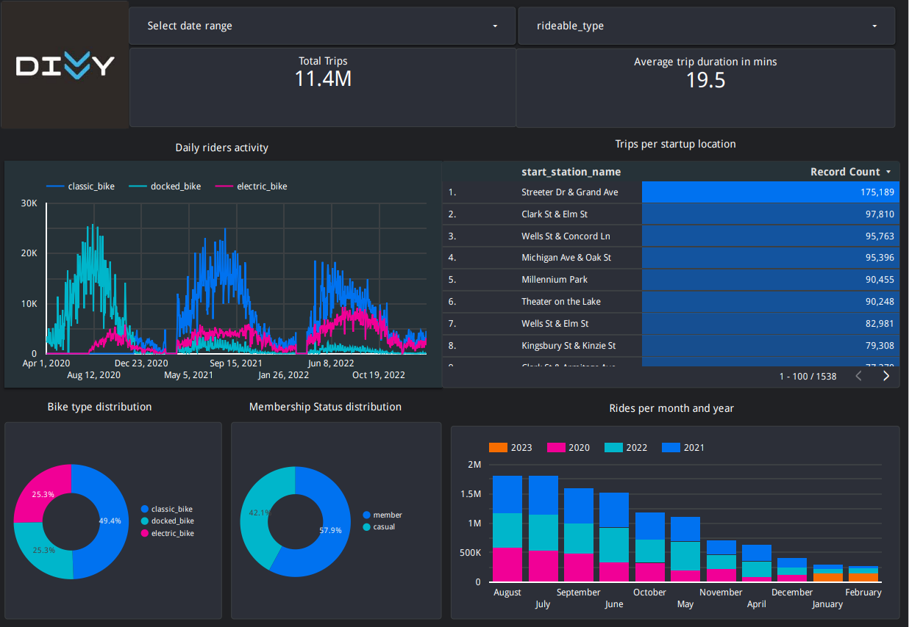

 
# Divvy Bikeshare Data Engineering Project 🚴‍♀️
This is an end to end data engineering project, This project uses [Chicago's Divvy bikeshare dataset](https://divvy-tripdata.s3.amazonaws.com/index.html), Divvy is the bicycle sharing system in the Chicago metropolitan area, currently serving the cities of Chicago and Evanston. The system is owned by the Chicago Department of Transportation and has been operated by Lyft since 2019.
## Problem Description
The purpose of this project is to make an end to end data pipeline which extracts the divvy data from the web https://divvy-tripdata.s3.amazonaws.com/index.html and Load this data in Google Cloud storage and Big Query , apply Kimbal Dimensional Modeling(Facts and Dimensions tables) to the data using dbt and build a Looker dashboard to 
vizualize
- Daily riders activity
- Trips per start stations
- Average trip duration
- Bike type distribution and Membership status distribution
- Rides per month and year
## Technology Stack 
The following technologies are used to build this project
- Google Cloud Storage (GCS) - as Data Lake <br>
- Google BigQuery - for Data Warehouse <br>
- Terraform - as Infrastructure-as-Code (IaC) tool <br>
- Prefect - for orchestration <br>
- dbt - for transformation and data modeling <br>
- Google Looker studio - for visualizations <br>
## Data Pipeline Architecture

## Data Dictionary
| Column | Description | 
|--------|-------------|
| r_id | Unique surrogate built using ride_id and started_at |
| ride_id | Unique ID Assigned to Each Divvy Trip |
| rideable_type | Type of bikes user can take out (Docked, Classic, Electric) |
| started_at  | Start of Trip Date and Time |
| ended_at | End of Trip Date and Time |
| start_station_name | Name of start station |
| start_station_id | Unique Identification Number of Station the Trip Started at |
| end_station_name | Name Assigned to Station the Trip Ended at |
| end_station_id | Unique Identification Number of Station the Trip Ended at|
| start_lat | Latitude of the Start Station|
|start_lng |Longitude of the Start Station|
|end_lat |Latitude of the End Station|
|end_lng |Longitude of the End Station|
|member_casual | Field with Two Values Indicating Whether the Rider has a Divvy Membership or Paid with Credit Card(Casual)|
## Dashboard
Check out the interactive dashboard [here](https://lookerstudio.google.com/reporting/3f37599d-b72c-4197-9cd3-8ca25288742f)



## Reproduce it yourself
1. First fork this repo, and clone it to your local environment.
`git clone https://github.com/Fozan-Talat/divvy-bikeshare-de-project.git`
3. Setup your Google Cloud environment
- Create a [Google Cloud Platform project](https://console.cloud.google.com/cloud-resource-manager)
- Configure Identity and Access Management (IAM) for the service account, giving it the following privileges: 
    - Viewer
    - Storage Admin 
    - Storage Object Admin 
    - BigQuery Admin
- Download the JSON credentials and save it, e.g. to `~/.gc/<credentials>`
- Install the [Google Cloud SDK](https://cloud.google.com/sdk/docs/install-sdk)
- Let the [environment variable point to your GCP key](https://cloud.google.com/docs/authentication/application-default-credentials#GAC), authenticate it and refresh the session token
```bash
export GOOGLE_APPLICATION_CREDENTIALS=<path_to_your_credentials>.json
gcloud auth activate-service-account --key-file $GOOGLE_APPLICATION_CREDENTIALS
gcloud auth application-default login
```
Check out this [link](https://www.youtube.com/watch?v=Hajwnmj0xfQ&list=PL3MmuxUbc_hJed7dXYoJw8DoCuVHhGEQb&index=11&t=29s)  for a video walkthrough.


3. Install all required dependencies into your environment
```bash
conda create -n divvy_project python=3.10
conda activate divvy_project
pip install -r requirements.txt
```
4. Setup your infrastructure
- Run the following commands to install Terraform - if you are using a different OS please choose the correct version [here](https://developer.hashicorp.com/terraform/downloads) and exchange the download link and zip file name

```bash
sudo apt-get install unzip
cd ~/bin
wget https://releases.hashicorp.com/terraform/1.4.1/terraform_1.4.1_linux_amd64.zip
unzip terraform_1.4.1_linux_amd64.zip
rm terraform_1.4.1_linux_amd64.zip
```
- change the variables.tf file with your corresponding variables, I would recommend to leave the name of the dataset, table and bucket as they are; otherwise you need to change them in the prefect flows and dbt.
- To initiate, plan and apply the infrastructure, adjust and run the following Terraform commands
```bash
cd terraform/
terraform init
terraform plan -var="project=<your-gcp-project-id>"
terraform apply -var="project=<your-gcp-project-id>"
```
- Type 'yes' when prompted.

5. Setup your orchestration
- If you do not have a prefect workspace, sign-up for the prefect cloud and create a workspace [here](https://app.prefect.cloud/auth/login)
- Create the [prefect blocks](https://docs.prefect.io/concepts/blocks/) via the cloud UI or adjust the variables in `/prefect/prefect_blocks.py` and run
```bash
python prefect/prefect_blocks.py
```
- To execute the flow, run the following commands in two different terminals
```bash
prefect agent start -q 'default'
```
```bash
python prefect/web_to_gcs_to_bq.py
```
- After running the flow web_to_gcs_to_bq.py you will find the data at divvy_data_raw.divvy_default_data, the flow will take around 45 mins to complete.
6. Data tranformation and modeling using dbt

`cd` into the dbt/divvy_project directory and run the following command
```bash
dbt build --var 'is_test_run: false'
```
You will get 4 tables in divvy_data_dbt data set 
  - dim_neighbourhoods
  - divvy_stations_lookup
  - facts_divvy
  - stg_divvy_data

7. Data Vizualization and Dashboarding
- You can now query the data and connect it to looker to visualize the data, when connecting to data source use facts_divvy table to build the data source in looker, dont use partitioned table, as you wont get any data in your report.
- go to [Looker Studio](https://lookerstudio.google.com/) &rarr; create &rarr; BigQuery &rarr; choose your project, dataset & transformed table.

