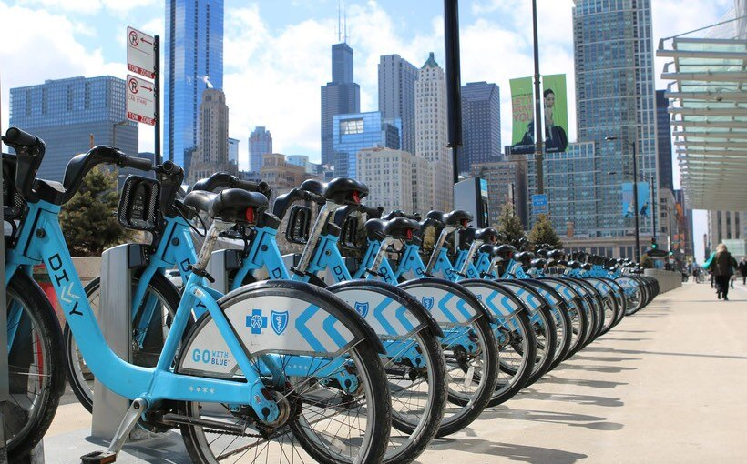

 
# Divvy Bikeshare Data Engineering Project 🚴‍♀️
This is an end to end data engineering project, This project uses [Chicago's Divvy bikeshare dataset](https://divvy-tripdata.s3.amazonaws.com/index.html), Divvy is the bicycle sharing system in the Chicago metropolitan area, currently serving the cities of Chicago and Evanston. The system is owned by the Chicago Department of Transportation and has been operated by Lyft since 2019.
## Problem Description
The purpose of this project is to make an end to end data pipeline which extracts the divvy data from the web https://divvy-tripdata.s3.amazonaws.com/index.html and Load this data in Google Cloud storage and Big Query , apply Kimbal Dimensional Modeling(Facts and Dimensions tables) to the data using dbt and build a Looker dashboard to 
vizualize
- Daily riders activity
- Trips per start stations
- Average trip duration
- Bike type distribution and Membership status distribution
- Rides per month and year
## Technology Stack 
The following technologies are used to build this project
- Google Cloud Storage (GCS) - as Data Lake  
- Google BigQuery - for Data Warehouse  
- Terraform - as Infrastructure-as-Code (IaC) tool  
- Prefect - for orchestration  
- dbt - for transformation and data modeling  
- Google Looker studio - for visualizations  
